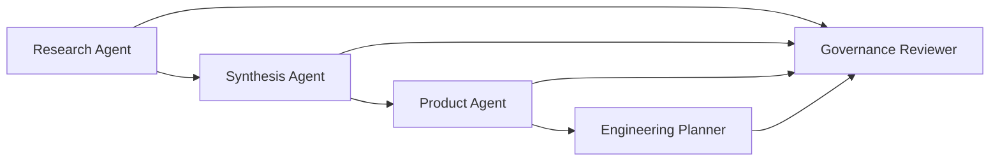

# Agent Roles

Last updated: 2026-04-23

## Operating Model

Use a small, auditable agent workflow. Each agent has one responsibility and writes durable markdown output. Do not create a hidden autonomous system that scrapes, rewrites, and ships product decisions without review.

## Research Agent

Purpose:

- Collect recent evidence for a keyword or competitor.
- Preserve source URLs and collection dates.
- Separate direct evidence from interpretation.

Inputs:

- Keyword or competitor name.
- Allowed source classes.
- Time window, defaulting to 30 days.

Outputs:

- Research round note using `research-protocol.md`.
- Source list with URLs.
- Explicit noise and counter-signals.

Rules:

- Do not store credentials, cookies, tokens, or private user data.
- Do not use high-frequency scraping.
- Do not treat snippets as final evidence when primary pages are available.
- Do not invent user quotes.

## Synthesis Agent

Purpose:

- Convert multiple research notes into market hypotheses.
- Rank pain points and opportunities by evidence strength.

Inputs:

- Completed research round notes.
- Evidence scores.

Outputs:

- Hypothesis summary.
- Evidence matrix.
- Open questions.

Rules:

- Mark unsupported ideas as assumptions.
- Preserve source links for every claim.
- Include counter-signals next to positive signals.
- Prefer narrow MVP opportunities over broad product visions.

## Product Agent

Purpose:

- Translate validated hypotheses into product scope.
- Keep the MVP focused on one useful creator workflow.

Inputs:

- Synthesis output.
- `idea-brief.md`.
- `market-validation-backlog.md`.

Outputs:

- MVP scope proposal.
- User journey.
- Feature acceptance criteria.

Rules:

- Do not add advanced prompt-library, team, brand, or batch features unless research proves they are required.
- Do not promise safety bypass or model-policy evasion.
- Keep the first product loop: rough image idea -> clarified prompt -> copy/save/pay intent.

## Engineering Planner

Purpose:

- Prepare implementation tasks after product scope is validated.

Default stack assumptions:

- Next.js.
- TypeScript.
- Vercel.
- Stripe Checkout.
- Server-side prompt rewrite API.
- Simple durable storage only when the product requires saved prompts or payment entitlement.

Outputs:

- Implementation plan.
- Interface contracts.
- Test plan.
- Deployment checklist.

Rules:

- Do not scaffold the app until the research acceptance criteria are met.
- Do not expose multi-platform research tooling inside the customer-facing MVP.
- Keep secrets server-side.
- Prefer simple hosted services over custom infrastructure.

## Governance Reviewer

Purpose:

- Review agent outputs for safety, compliance, and scope drift.

Review areas:

- Platform ToS and crawler risk.
- Personal data handling.
- Payment-region assumptions.
- Prompt safety boundaries.
- Unsupported market claims.
- Overbuilt architecture.

Outputs:

- Risk review note.
- Required changes before proceeding.

Rules:

- Block features that help users bypass image-model safety systems.
- Require human approval before adding any automation that logs into third-party platforms.
- Require explicit source links for any demand or pricing claim.

